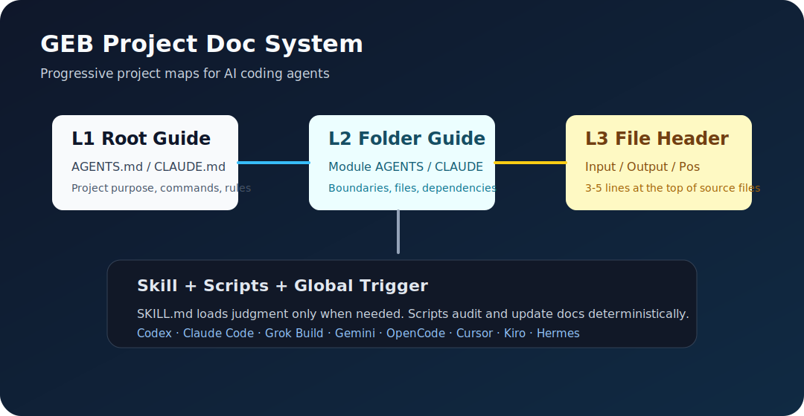

# my_skill

老党的开源 Skill 仓库：把反复验证过的 Agent 工作方法，沉淀成可复用、可安装、可测试的 Skills。

[English](#english) · [GitHub](https://github.com/DwDestiny/my_skill) · [Issue #5](https://github.com/DwDestiny/my_skill/issues/5)



## 为什么这个仓库存在

很多 Agent 配置最后都会变成一堆长提示词：看起来很完整，真正工作时却触发不稳、不可测试、不可复用。

这个仓库的目标更直接：把高价值工作流做成 Skill。Skill 本体保持轻，细节放 references，重复动作放 scripts，最后用测试和真实项目狗粮验证。

## Skill 目录

| Skill | 路径 | 状态 | 适用场景 |
|---|---|---|---|
| product-expert | `skills/product-expert/` | 已入库 | 从一个产品想法出发，完成需求探知、产品定位、MVP 规划、评分和推荐 |
| visual-ppt-deck-builder | `skills/visual-ppt-deck-builder/` | 已入库 | 从主题、大纲和风格样张出发，生成高视觉质量且可编辑的 PPTX |
| wechat-ops-performance-review | `skills/wechat-ops-performance-review/` | 已入库 · 可 plugin / npx 安装 | 公众号运营复盘：量化诊断 + 爆款基因反推 + 向前看方向引擎 + 本地叙事看板（详见该目录 `README.md`） |
| geb-project-doc-system | `skills/geb-project-doc-system/` | v0.2 | 为大中型代码仓库建立 L1/L2/L3 AI 项目文档体系，减少 Agent 盲读和上下文浪费 |

## 重点：GEB Project Doc System

`geb-project-doc-system` 是给大项目用的 AI 项目地图 Skill。

它不试图让 Agent 一次读完整个仓库，而是让 Agent 按层读取：


适合这些场景：

- 中大型代码仓库，新会话经常重新摸项目。
- 多 Agent 协作，经常有人改结构但不更新项目说明。
- Claude Code、Codex、Grok Build、Gemini、OpenCode 等工具混用。
- 你希望减少盲读文件、重复解释和 token 浪费。

## 快速开始

## 写入侧契约

GEB 不只是读取顺序。新项目要创建或更新 L1 根文档；新增或扩展目录/模块要创建或更新 L2 目录文档；新增源文件、测试、重要配置或长期脚本要补短 L3 文件头。文档是变更的一部分，结构变更验收前必须按 L3 -> L2 -> L1 回写。

## 用户安装向导

第一次做整机接入时，不要静默装到所有目录。先用产品化入口检测本地标准 Agent、插件/能力运行区和项目候选，用户确认后再写入：

```bash
scripts/install_geb_project_doc_system.sh --json
scripts/install_geb_project_doc_system.sh --agents codex,claude --apply
scripts/install_geb_project_doc_system.sh --project /path/to/repo --install-hooks --apply
```

脚本只做机械发现和执行：发现 Agent 入口、建立 Skill 链接、写入受管理 snippet、安装已确认项目的 hook。已有全局提示词是否语义合格，应由智能体读取后判断，不由脚本猜。

向导交付的结果应包括：已检测的标准 Agent、单列的插件/能力运行区、用户选择的配置范围、项目候选清单、hook 安装状态、验收命令、剩余风险和 estimated token savings。

首次接入一个项目或一组本机 Agent 工作区时，先做初始化盘点，不要直接全量写文件头：

1. 列出目标：普通项目仓库、Agent 底座、活跃会话、历史归档分别归类。
2. 如果是混合工作台，先拆开内容工作流、产品子项目、引用代码、生成资产、运行态和活跃源码。
3. 如果是交易、部署、gateway 或运行时关键仓库，先建 issue 或 issue 草稿，冻结高风险运行路径。
4. 明确排除区：`secrets`、`.env`、`sessions`、`logs`、`cache`、`node_modules`、`venv`、`.claude/worktrees`、生成物、浏览器 profile、数据库。
5. 先解释 audit findings 属于源码、生成物、引用代码、产品子项目还是运行态，不要把 findings 当待办清单。
6. 先选一个小的样板项目跑通流程，再扩到 P0 项目。
7. 每个项目先补 L1/L2，最后才按模块 dry-run 并写入 L3。

审计一个项目：

```bash
python3 skills/geb-project-doc-system/scripts/audit_geb_docs.py /path/to/repo
```

先 dry-run 看会补哪些文件头：

```bash
python3 skills/geb-project-doc-system/scripts/update_file_headers.py /path/to/repo/safe-module --json
```

确认样板模块边界后再写入；不要对混合工作台根目录或运行态根目录直接 `--apply`：

```bash
python3 skills/geb-project-doc-system/scripts/update_file_headers.py /path/to/repo/safe-module --apply
```

安装 Git hook：

```bash
skills/geb-project-doc-system/scripts/install_git_hook.sh /path/to/repo
```

## 推荐安装方式

先运行安装向导做检测；默认只报告，不写入。确认标准 Agent 清单后，再显式选择要配置的 Agent，并用 `--apply` 写入 Skill 链接和全局短提示词。插件/能力运行区会单独列出，不计入标准 Agent。

```bash
scripts/install_geb_project_doc_system.sh --json
scripts/install_geb_project_doc_system.sh --agents codex,claude --apply
scripts/install_geb_project_doc_system.sh --project /path/to/repo --install-hooks --apply
```

也可以手动链接：

```bash
ln -sfn "$(pwd)/skills/geb-project-doc-system" ~/.codex/skills/geb-project-doc-system
ln -sfn "$(pwd)/skills/geb-project-doc-system" ~/.claude/skills/geb-project-doc-system
ln -sfn "$(pwd)/skills/geb-project-doc-system" ~/.grok/skills/geb-project-doc-system
```

再在全局 `AGENTS.md` / `CLAUDE.md` 放一段短声明：

```md
仓库工作默认遵守 GEB 项目文档规范。读文件前按 L1/L2/L3 渐进披露；
写文件时也按 GEB 记录：新项目更新 L1，新模块更新 L2，新文件补短 L3；
结构变更后同步更新 L3 -> L2 -> L1。初始化、审计或迁移时使用
`geb-project-doc-system` Skill。
```

全局文档只放短声明，不要把完整规范塞进去。完整规则按需从 Skill 加载。

## 验证

```bash
scripts/check_skill_structure.sh skills/geb-project-doc-system
python3 tests/test_geb_project_doc_system.py
tests/smoke_visual_ppt_deck_builder.sh
```

## 一键安装（wechat-ops-performance-review）

该 skill 提供两条**等价**的安装通道，最终都把只读模板落到 `~/.claude/skills`，按习惯任选其一。

**通道 A · Claude Code plugin marketplace**（图形化、托管式更新）

本仓库根的 `.claude-plugin/marketplace.json` 把仓库声明为一个 plugin marketplace。在 Claude Code 里：

```
/plugin marketplace add DwDestiny/my_skill
/plugin install wechat-ops-performance-review@maizong-skills
```

- `@` 后是 marketplace 名（`maizong-skills`），不是仓库名。
- 安装后 skill 自动被发现，按任务上下文调用。

**通道 B · npx 一键安装**（命令行、可脚本化，见 `packages/create-wechat-ops-skill/`）

```bash
npx create-wechat-ops-skill
```

默认装到 `~/.claude/skills/wechat-ops-performance-review/`；支持 `[目标目录] --ref --force`，私有仓需 `GIGET_AUTH`。

**安装后首次使用**（两条通道一致）：装依赖后即可跑 demo 验证全链路——

```bash
cd ~/.claude/skills/wechat-ops-performance-review
pip install -r requirements.txt && playwright install chromium
python3 scripts/wxops analyze --demo
```

skill 目录为只读模板，所有运行态数据写入工作区 `~/.wxops`，看板由 `analyze` 自动构建，无需手动 `pnpm install`。

## 仓库结构

```text
.claude-plugin/
  marketplace.json          # 把本仓声明为 plugin marketplace
skills/
  product-expert/
  visual-ppt-deck-builder/
    SKILL.md
    agents/openai.yaml
    references/
    scripts/
  wechat-ops-performance-review/
    .claude-plugin/plugin.json   # 单 skill plugin 清单
    SKILL.md
    README.md                    # 产品门面 + 看板截图画廊
    DESIGN.md / DATA_CONTRACT.md
    scripts/                     # wxops CLI + 抓取/分析/构建
    dashboard/                   # 本地叙事看板(Vite + React)
    references/ fixtures/ tests/ docs/
  geb-project-doc-system/
packages/
  create-wechat-ops-skill/       # npx 一键安装包(create-* 约定)
docs/
  repository-architecture.md
  skill-intake-checklist.md
  assets/
scripts/
tests/
templates/
```

## 新增 Skill 的标准

- `SKILL.md` 必须有 `name` 和 `description`。
- description 只写触发条件，不总结完整流程。
- 长资料放 `references/`，可重复动作放 `scripts/`。
- 先写压力场景或测试，再写 Skill。
- README 的 Skill 目录必须同步更新。
- 不提交密钥、账号、令牌或私有日志。

## 致谢与许可证边界

`geb-project-doc-system` 受赵纯想公开分享的 GEB 分形文档系统思路启发，尤其是 L1 根文档、L2 目录文档、L3 文件头 `Input / Output / Pos` 的分层项目地图思想。

开发过程中参考过这些开源项目的产品形态和落地经验：

- [`Claudate/project-multilevel-index`](https://github.com/Claudate/project-multilevel-index) — MIT License，提供完整 L1/L2/L3 自动化工具形态参考。
- [`longranger2/project-doc-bootstrap`](https://github.com/longranger2/project-doc-bootstrap) — MIT License，提供 `CLAUDE.md` / `AGENTS.md` 分层文档 Skill 形态参考。

本仓库首版 `geb-project-doc-system` 的 Skill 文档、审计脚本和文件头更新脚本为独立实现，不是上述项目的官方版本，也不代表赵纯想本人或相关项目背书。若未来复制、改编或合并第三方项目代码，应保留原项目版权声明和许可证文本，并在变更说明中明确标注来源。

## License

MIT. See [LICENSE](LICENSE).

---

## English

`my_skill` is an open-source skill repository for reusable, tested agent workflows.

Instead of growing one giant global prompt, each workflow becomes a focused Skill: light `SKILL.md`, deeper `references/`, deterministic `scripts/`, and real validation.

## Skills

| Skill | Path | Status | Use case |
|---|---|---|---|
| product-expert | `skills/product-expert/` | Available | Product discovery, positioning, MVP planning, scoring, and recommendation |
| visual-ppt-deck-builder | `skills/visual-ppt-deck-builder/` | Available | Build high-quality editable PPTX decks from a topic, outline, and visual direction |
| wechat-ops-performance-review | `skills/wechat-ops-performance-review/` | Available · plugin / npx | WeChat Official Account ops review: quantified diagnosis, viral-DNA reverse-engineering, forward-looking direction engine, and a local narrative dashboard |
| geb-project-doc-system | `skills/geb-project-doc-system/` | v0.2 | Maintain L1/L2/L3 AI-facing project documentation for medium and large code repositories |

## GEB Project Doc System

`geb-project-doc-system` helps AI coding agents understand a repository progressively:

- **L1 root guide**: `AGENTS.md` / `CLAUDE.md`
- **L2 folder guide**: module boundaries, files, dependencies, local rules
- **L3 file header**: short `Input / Output / Pos` coordinates for source files

The goal is simple: read the map before reading the whole world.

## Quick Start

## Write-side Contract

GEB is not only a reading order. For a new project, create or update the L1 root guide. For a new or expanded module, create or update the L2 folder guide. For a new source file, test file, important config file, or durable script, add a short L3 header. Documentation is part of the change, so structure changes update L3 -> L2 -> L1 before acceptance.

## User Onboarding Flow

For a first machine-wide rollout, do not install everywhere silently.

Use `scripts/onboard_geb_project_doc_system.py` as the productized entrypoint. It has no writes without --apply. It configures standard agents only, lists plugin runtimes separately, can install a pre-commit hook for confirmed Git projects, and finishes with an acceptance report.

1. First detect local agents and show a detected agent list.
2. Ask the user to choose which agents to configure.
3. Install the Skill and short global prompt only for the selected agents.
4. Build a project candidate list from owned, active repositories.
5. Ask the user to confirm the project candidate list before bulk changes.
6. Produce a digitalization plan, then migrate L1/L2/L3 module by module.
7. Finish with an acceptance report that lists configured agents, upgraded projects, exclusions, validation commands, residual risks, and estimated token savings.

## First-time Bootstrap

For the first use in a project or local agent workspace, start with a read-only inventory instead of writing headers immediately:

1. Classify targets as project repositories, Agent runtime, active sessions, or archives.
2. For mixed workspaces, split content workflows, product subprojects, reference code, generated assets, runtime state, and active source code.
3. For trading, deployment, gateway, or other high-risk runtime paths, create an issue or issue draft before writing docs.
4. Exclude `secrets`, `.env`, `sessions`, `logs`, `cache`, `node_modules`, `venv`, `.claude/worktrees`, generated outputs, browser profiles, and databases.
5. Classify audit findings before action; do not treat them as a to-do list.
6. Pick one small sample project first, then expand to P0 projects.
7. Add or trim L1/L2 before dry-running and applying L3 headers module by module.

Audit a repository:

```bash
python3 skills/geb-project-doc-system/scripts/audit_geb_docs.py /path/to/repo
```

Preview missing file headers:

```bash
python3 skills/geb-project-doc-system/scripts/update_file_headers.py /path/to/repo/safe-module --json
```

Apply headers only after reviewing the sample module boundary; do not run `--apply` directly on a mixed workspace root or runtime root:

```bash
python3 skills/geb-project-doc-system/scripts/update_file_headers.py /path/to/repo/safe-module --apply
```

Install the pre-commit hook:

```bash
skills/geb-project-doc-system/scripts/install_git_hook.sh /path/to/repo
```

## Installation

Run the onboarding wrapper first. It reports by default and writes nothing until the user selects standard agents or projects and passes `--apply`. Plugin/capability runtimes are listed separately and are not treated as standard agents.

```bash
scripts/install_geb_project_doc_system.sh --json
scripts/install_geb_project_doc_system.sh --agents codex,claude --apply
scripts/install_geb_project_doc_system.sh --project /path/to/repo --install-hooks --apply
```

The script handles mechanical work only: detecting entries, linking the Skill, writing the managed snippet, and installing confirmed project hooks. Existing global prompt quality is a semantic review task for the agent, not a script heuristic.

Or link the Skill manually:

```bash
ln -sfn "$(pwd)/skills/geb-project-doc-system" ~/.codex/skills/geb-project-doc-system
ln -sfn "$(pwd)/skills/geb-project-doc-system" ~/.claude/skills/geb-project-doc-system
ln -sfn "$(pwd)/skills/geb-project-doc-system" ~/.grok/skills/geb-project-doc-system
```

Then add a short global rule to `AGENTS.md` / `CLAUDE.md`:

```md
Repository work follows the GEB project documentation standard by default.
Before reading files, load L1/L2/L3 progressively. When writing files,
create or update L1 for new projects, L2 for new modules, and short L3
headers for new source/test/config/script files. After structural changes,
update L3 -> L2 -> L1. Use the `geb-project-doc-system` Skill for
initialization, audit, or migration.
```

Keep global prompts short. Load the Skill when detail is needed.

## Validation

```bash
scripts/check_skill_structure.sh skills/geb-project-doc-system
python3 tests/test_geb_project_doc_system.py
tests/smoke_visual_ppt_deck_builder.sh
```

## Acknowledgements and License Boundaries

`geb-project-doc-system` is inspired by Zhao Chunxiang's public discussion of the GEB fractal documentation idea, especially the layered map of L1 root guides, L2 folder guides, and L3 `Input / Output / Pos` file headers.

The implementation also learned from these open-source projects:

- [`Claudate/project-multilevel-index`](https://github.com/Claudate/project-multilevel-index) — MIT License, useful as a reference for full L1/L2/L3 automation.
- [`longranger2/project-doc-bootstrap`](https://github.com/longranger2/project-doc-bootstrap) — MIT License, useful as a reference for `CLAUDE.md` / `AGENTS.md` skill packaging.

The first version of `geb-project-doc-system` is an independent implementation. It is not an official release from those projects and is not endorsed by Zhao Chunxiang or the referenced repositories. If future versions copy, adapt, or merge third-party code, the original copyright notices and license texts must be preserved and the source must be documented in the changelog or release notes.

## License

MIT. See [LICENSE](LICENSE).
