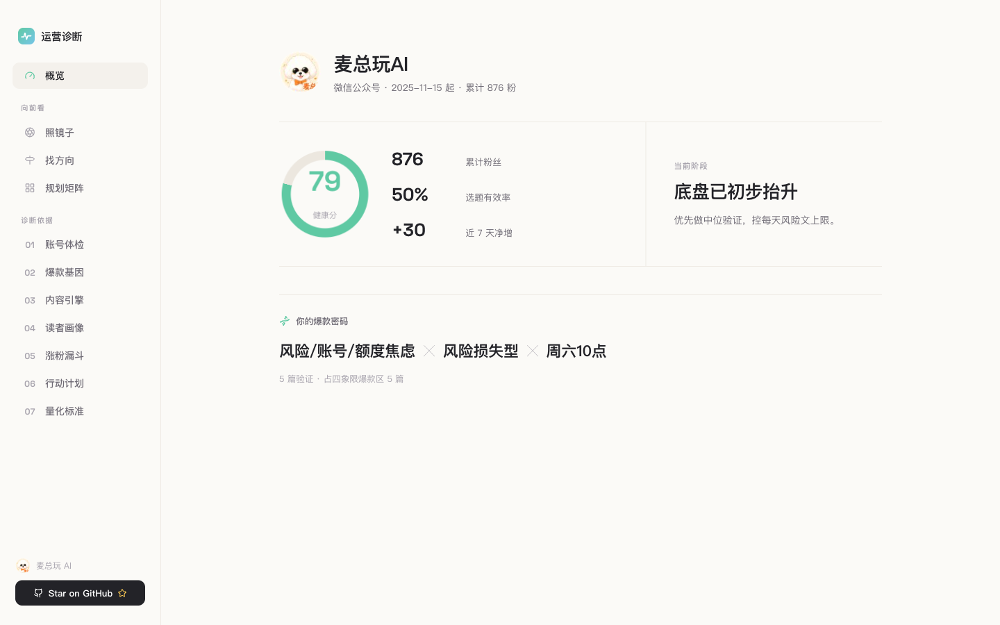
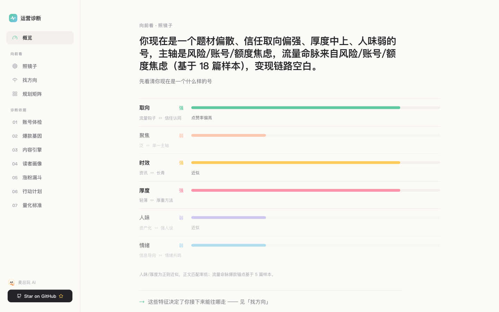
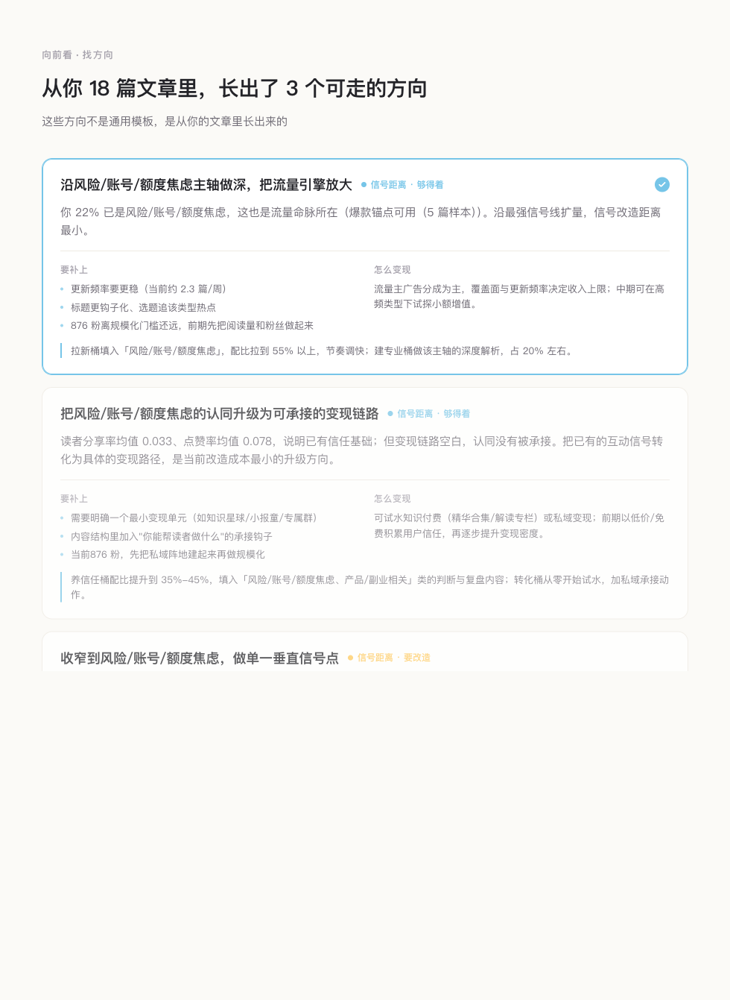
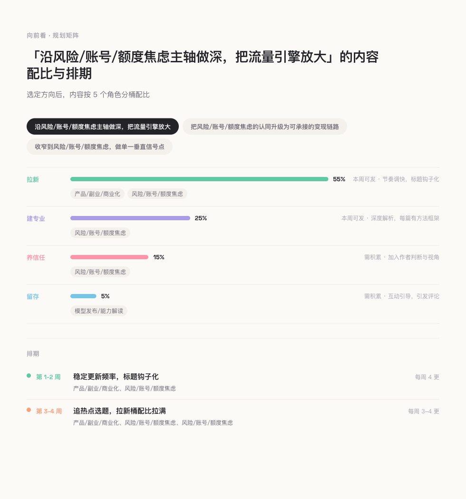
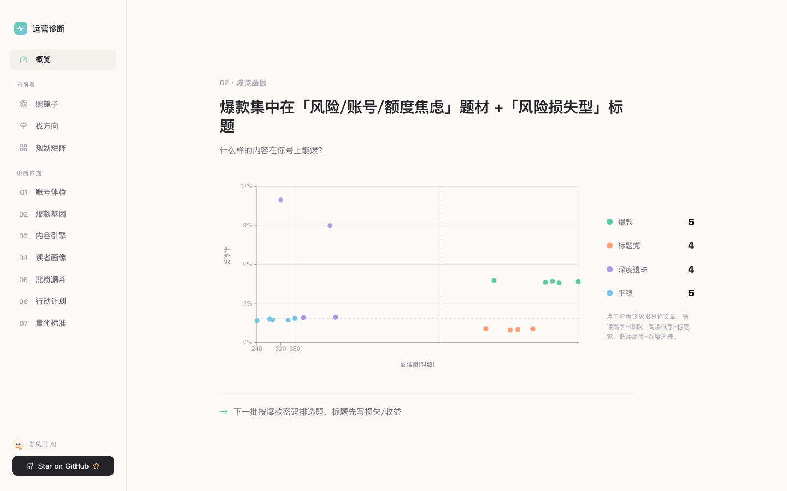
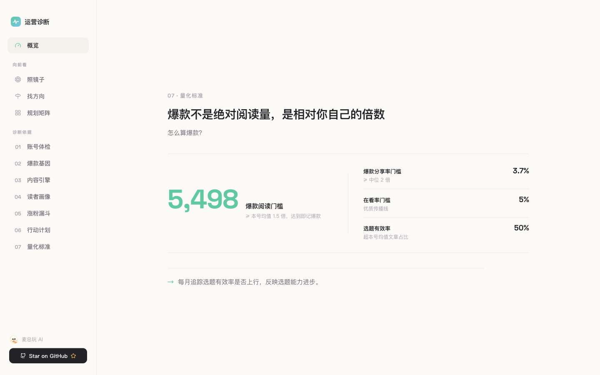
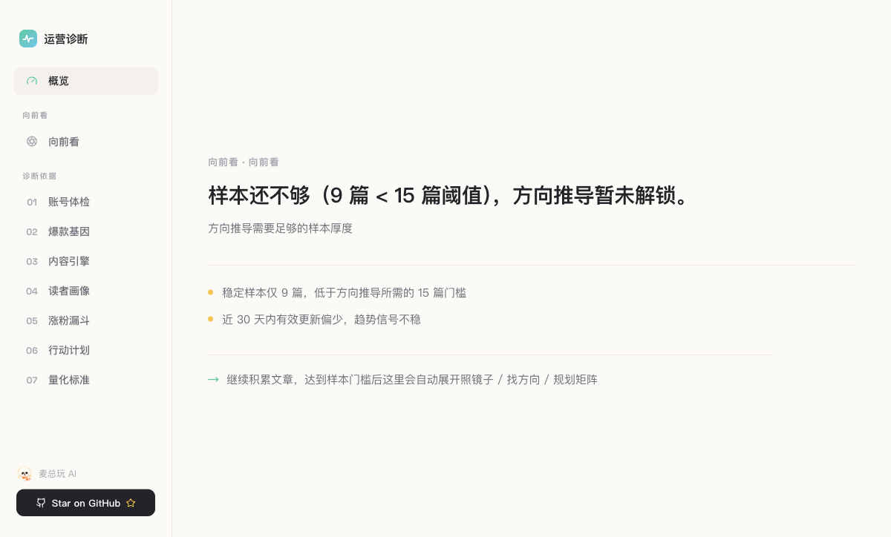
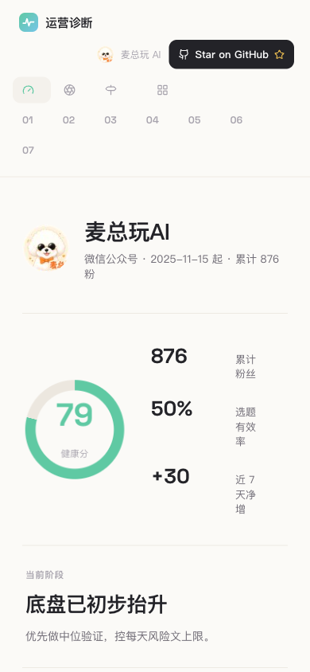

<div align="center">

# 公众号运营复盘 · WeChat Ops Performance Review

**把公众号后台数据，变成「下一步该写什么」的决策报告。**

大多数「公众号分析」止步于诊断——告诉你哪儿不行。
这个 Skill 多走三步:**照镜子**(你现在是个什么号)→ **找方向**(接下来能往哪走)→ **规划矩阵**(下周具体写什么)。

所有方向都是从你**自己的历史文章**里反推出来的,不是通用模板。

</div>

---

## 一屏看懂这个号



健康分、累计粉丝、选题有效率、近 7 天净增,加上一句当前阶段判断。
右下角那行 **「你的爆款密码」**——题材 × 标题型 × 发布时段——是从你过往爆款里反推出来的,不是平台通用经验。

---

## 不只诊断,更向前看

这是产品的内核:看完「你哪儿不行」之后,还得有人告诉你「那接下来怎么办」。三屏一条链路走完。

### 1 · 照镜子 — 先说清你是个什么号



一句话画像打头,六个维度(取向 / 聚焦 / 时效 / 厚度 / 人味 / 情绪)摆开,强弱一眼可见。
不灌一堆评分,不拿数字羞辱你——只把你这个号的「形状」如实照出来。

### 2 · 找方向 — 从你的文章里长出可走的路



从这个号的 18 篇文章里,长出 **3 个可走的方向**。每个方向都标了「信号距离」——是顺手够得着,还是要改造才行——并直接告诉你:**要补上什么、怎么变现**。
方向是动态反推的,换一个号就是另一组方向。

### 3 · 规划矩阵 — 落到下周写什么



选定一个方向,自动给出内容配比(拉新 / 建专业 / 养信任 / 留存)和四周排期。
**「想清楚」到「下周排几篇、各写什么题材」** 一步到位。选方向时,这屏和上面的找方向是联动的——换方向,配比和排期跟着重算。

---

## 爆款基因反推



四象限散点把每篇文章定位:高读高享是**爆款**,高读低享是**标题党**,低读高享是**深度遗珠**。
点开任一象限能下钻到具体文章。结论很直接——**什么题材 + 什么标题型,在你这个号上能爆**。

---

## 爆款标准,相对你自己



爆款不是绝对阅读量,是相对你自己的倍数。
一个号一个基准:本号均值的 1.5 倍即记爆款。10 万粉的号和 800 粉的号,不该用同一把尺子。

---

## 诚实:样本不够,就不编故事



**置信度是内化的**——样本够不够,产品自己判断,但不会拿一串「置信度 73%」糊你脸。
样本不到门槛(图中 9 篇 < 15 篇),向前看的三屏直接锁住,不硬凑结论。等你文章攒够,这里自动展开。
你看到的每个方向,背后都有足够样本撑着;看不到的,是因为还不该下结论。

---

## 手机上一样能看

<div align="center">

</div>

侧栏导航收口成顶部横排,内容单列堆叠。响应式从桌面一路适配到手机。

---

## 它怎么工作

```
公众号后台数据 / publish-records JSON
        ↓  抓取层(文章 + 账号 + 粉丝画像 + 内容趋势)
        ↓  分析层(爆款基因反推 + 全局基准 + 向前看方向引擎)
        ↓  一份结构化数据集(wiki JSON + Markdown + 看板共用同源)
        ↓
   本地叙事看板(上图)
```

一份数据,三种出口:wiki 结构化 JSON、Markdown 报告、本地交互看板,全部来自同一份契约,不会各算各的。

---

> **关于截图数据**:以上全部基于**脱敏模拟样本**。账号名与头像经本人授权公开,运营数据(阅读量 / 粉丝 / 画像 / 趋势)均为合成,**不含任何真实后台数据或可追溯链接**。

<div align="center">

如果这个 Skill 帮到了你,欢迎点亮 ⭐

</div>
