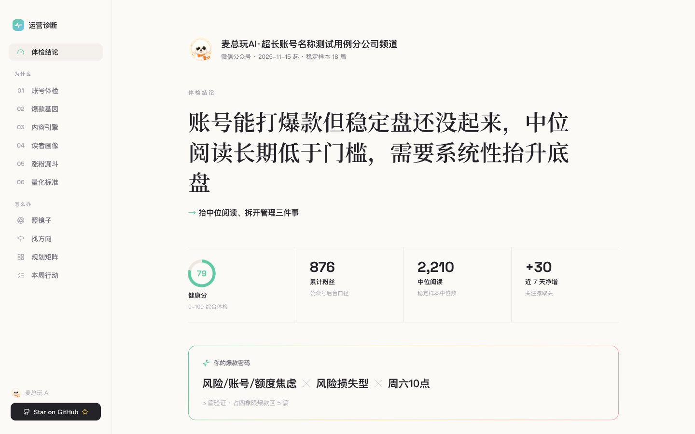
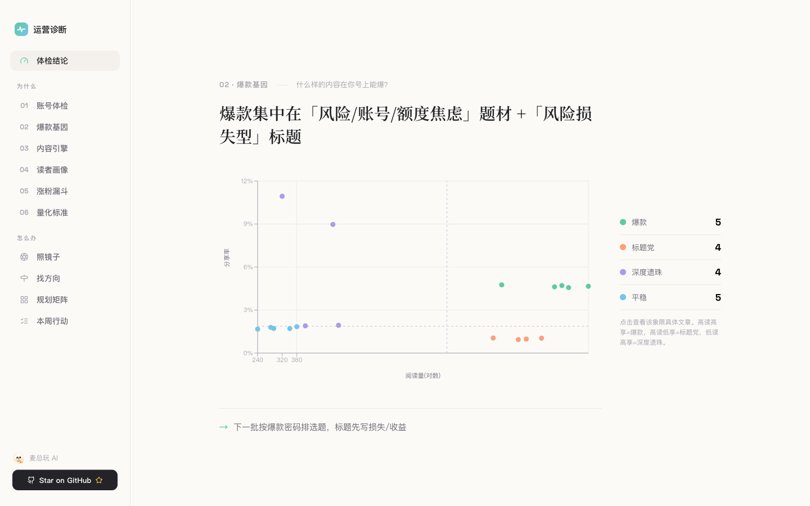
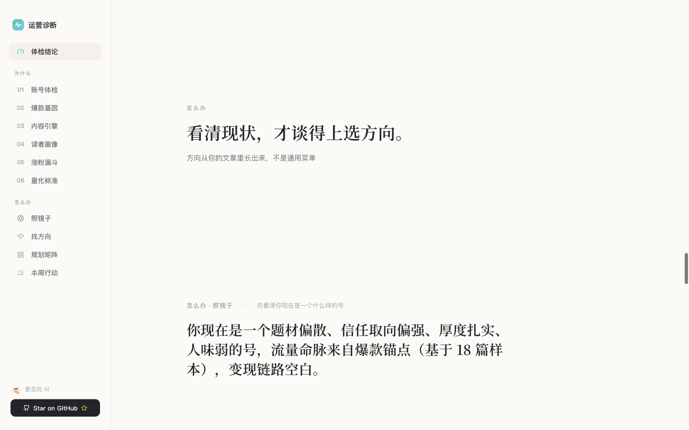
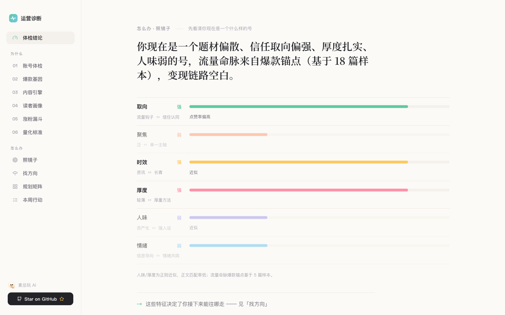
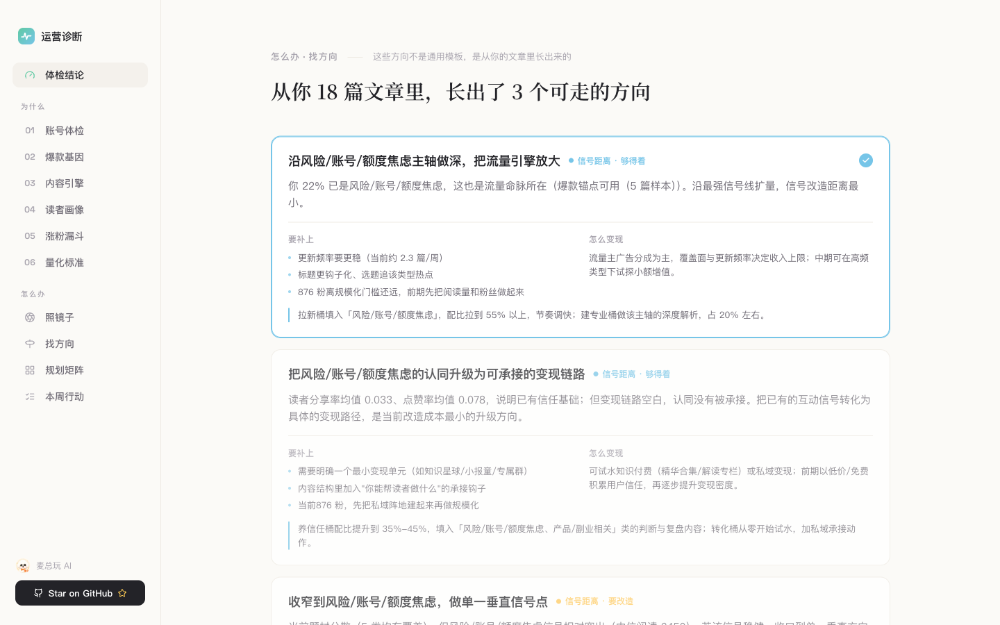
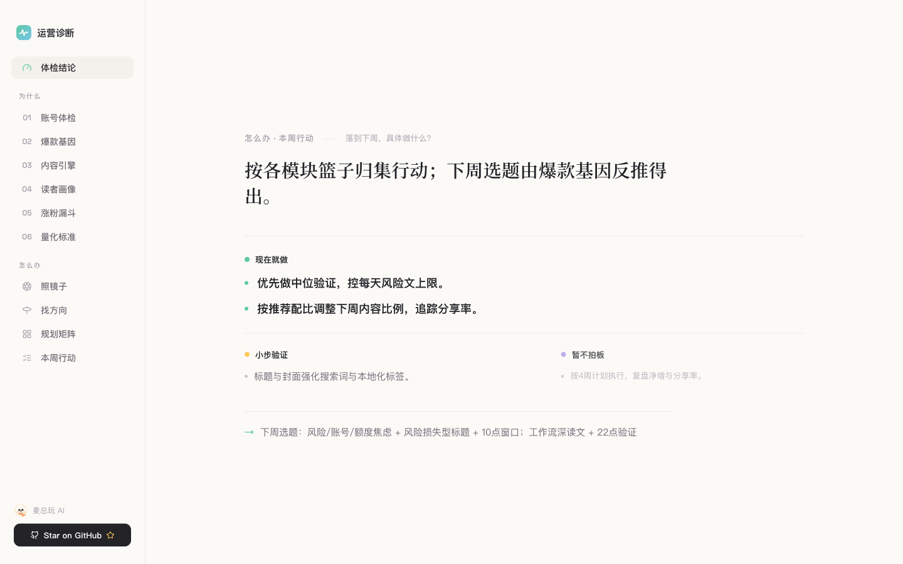

<div align="center">

# 公众号运营复盘 · WeChat Ops Performance Review

**把公众号后台数据，变成「下一步该写什么」的决策报告——不是图表墙，是一条完整的引导式分析链路。**

大多数「公众号分析」止步于诊断：告诉你哪儿不行，然后没了。
这个 Skill 从你**自己的历史文章**出发，一步步推导结论、方向与排期——**照镜子 → 找方向 → 规划矩阵 → 本周行动**，全链路走完。

</div>

---

## 这个 Skill 强在哪

### 亮点一：分析思路完整——从数据到决策，五步引导

不是把指标堆成 dashboard，而是一条**有顺序、有推导**的分析链路。每一步都回答一个明确问题，下一步建立在上一环的证据之上。

| 步骤 | 回答什么 | 机制 |
|------|----------|------|
| **① 探测问题** | 这个号现在卡在哪？ | 健康体检：依赖度、互动结构、粉丝画像；先识别账号类型，再按类型口径读指标 |
| **② 反推爆款** | 什么内容在本号能爆？ | 四象限散点（高读高享 / 高读低享 / 低读高享 / 双低）+ 爆款基因公式：题材 × 标题型 × 发布时段 |
| **③ 推导方向** | 接下来该写什么类型？ | 选题引擎、内容类型表现排行；从 18 篇历史文章里反推有效题材，不是通用模板 |
| **④ 引导选择** | 这个号能往哪走、怎么变现？ | 照镜子（六维账号画像）→ 候选路径（信号距离 + 要补什么 + 变现方式），引导用户做方向选择 |
| **⑤ 落到计划** | 下周具体排几篇、写什么？ | 内容矩阵（拉新 / 建专业 / 养信任 / 留存配比）+ 四周行动计划 + 本周行动清单 |

**强在哪里，具体说：**

- **账号类型自动路由**（`scripts/analyze/m9_account_type.py` + [`references/account-type-playbooks.md`](references/account-type-playbooks.md)）：引擎识别 6 大类型（媒体资讯 / 内容 IP / 知识服务 / 私域转化 / 企业品牌 / 本地生活），信号不足回退通用链路。同一份「阅读中位 800、评论率 0.2%」，资讯号是正常，IP 号是人设失灵——**不同类型自动走不同诊断口径**，类型间不判优劣。
- **置信度内化**（[`references/confidence-internalization.md`](references/confidence-internalization.md)）：样本够不够、分布偏不偏，引擎内部算；UI **不出现「置信度 73%」**。置信度化为三件事——**怎么说**（肯定 / 建议 / 谨慎）、**放多大**（hero / primary / secondary）、**归哪档**（现在就做 / 小步验证 / 暂不拍板）。样本不足时向前看三屏直接锁住，不硬凑结论。
- **决策报告哲学**：一份数据三种出口（wiki JSON、Markdown 报告、本地看板），全部同源契约；每屏一结论，证据与动作随行，拒绝图表墙。

---

### 亮点二：看板高级——三幕叙事 + 编辑感设计

看板不是「把报告贴成网页」，而是**三幕结构的决策体验**：体检结论 → 为什么（01–06 证据）→ 怎么办（照镜子 / 找方向 / 规划矩阵 / 本周行动）。设计细节见 [`DESIGN.md`](DESIGN.md)。

#### 第一幕 · 打开即见总判断



衬线大字一句总判断（「能打爆款，但稳定盘没起来」）→ 数字带证明有据 → 右下角爆款基因卡把规律收成可记住的配方。字体分工即语义层级：**衬线只给判断句，无衬线 / Space Grotesk 管数据**——扫一眼就知道「这是结论」还是「这是证据」。

#### 第二幕 · 01–06 证据链



七模块按思考链展开：体检 → 爆款四象限 → 内容类型 → 读者画像 → 涨粉趋势 → 量化标准。四象限是全站 signature 数据屏——每篇文章定位到「爆款 / 标题党 / 深度遗珠 / 待提升」，反推**什么题材 + 什么标题型在本号能爆**。爆款标准相对自身：本号均值的 1.5 倍即记爆款，10 万粉号和 800 粉号不用同一把尺子。

幕与幕之间用**幕间提问屏**过渡——一句衬线提问 + 大量留白，让读者自己「问出」下一幕：



#### 第三幕 · 向前看：照镜子 → 找方向 → 排计划



一句话画像打头，六个维度（取向 / 聚焦 / 时效 / 厚度 / 人味 / 情绪）摆开——不灌评分，只把你这个号的「形状」如实照出来。



从历史文章里长出 **3 条可走的路**。每条标信号距离（顺手够得着 / 要改造才行）、要补什么、怎么变现——方向是动态反推的，换一个号就是另一组方向。



选定方向后，内容矩阵给出配比与四周排期；三篮子行动清单按置信做**重量差**——「现在就做」大字强色、「小步验证」正常、「暂不拍板」缩小降灰。置信度内化为版面响度，不出现任何分数。

**设计节奏**：主列 max-width 1020px，文字块收窄到 ~660px 阅读宽、图表铺满主列——宽窄交替本身就是错落节奏；`scroll-snap` 一屏一事，每屏只有一个视觉焦点。

---

## 诚实：样本不够，就不编故事


样本不到门槛（如 9 篇 < 15 篇），向前看的照镜子 / 找方向 / 规划矩阵直接锁住，不硬凑结论。你看到的每个方向，背后都有足够样本撑着；看不到的，是因为还不该下结论。

---

## 手机上一样能看

<div align="center">

</div>

侧栏导航收口成顶部横排，内容单列堆叠。响应式从桌面一路适配到手机。

---

## 它怎么工作

```
公众号后台数据 / publish-records JSON
        ↓  抓取层（文章 + 账号 + 粉丝画像 + 内容趋势）
        ↓  分析层（账号类型路由 + 爆款基因反推 + 向前看方向引擎 + 置信度内化）
        ↓  一份结构化数据集（wiki JSON + Markdown + 看板共用同源）
        ↓
   本地叙事看板（上图）
```

一份数据，三种出口：wiki 结构化 JSON、Markdown 报告、本地交互看板，全部来自同一份契约，不会各算各的。

---

## 快速开始

**通过 Claude Code plugin 一键装**（推荐）：

```
/plugin marketplace add DwDestiny/my_skill
/plugin install wechat-ops-performance-review@maizong-skills
```

**装依赖**（首次）：

```bash
pip install -r requirements.txt && playwright install chromium   # Python 抓取（必需）
# 看板为可选：构建需 Node >= 18 + pnpm。analyze 会把 dashboard 复制到 ~/.wxops/dashboard 并自动 pnpm install；
# 本机无 pnpm 或只想看数据时，用 analyze --data-only 跳过看板构建。
```

**三步上手**（向导式 CLI）：

```bash
scripts/wxops init      # 环境自检 + 建工作区（默认 ~/.wxops）
scripts/wxops login     # 扫码登录公众号后台
scripts/wxops analyze   # 抓取 → 构建报告 → 启动看板
```

不想登录、先看效果（首跑推荐 `--data-only`，无需 pnpm）：

```bash
scripts/wxops analyze --demo --data-only   # 用内置脱敏样本跑通分析链路（跳过看板构建）
```

> **运行契约**：skill 目录是只读模板，所有运行态产物落工作区（默认 `~/.wxops`）。报告与看板数据写入 `~/.wxops/output/report.json`，看板源码复制到 `~/.wxops/dashboard/` 后在工作区里构建。skill 可放在只读路径（plugin / npx 分发）正常运行。

---

## 方法论文档索引

| 文档 | 内容 |
|------|------|
| [`SKILL.md`](SKILL.md) | 触发规则、标准工作流、输出契约、验收方式 |
| [`DESIGN.md`](DESIGN.md) | 看板设计系统：字阶、色彩、三幕动线、组件规范 |
| [`DATA_CONTRACT.md`](DATA_CONTRACT.md) | `report.json` 字段契约与 schema 约束 |
| [`references/account-type-playbooks.md`](references/account-type-playbooks.md) | 6 大账号类型识别信号、差异化诊断口径与 playbook |
| [`references/confidence-internalization.md`](references/confidence-internalization.md) | 置信度三通道映射（voice / emphasis / action_basket） |
| [`references/report-contract.md`](references/report-contract.md) | 报告章节结构与渲染规则 |
| [`references/data-sources.md`](references/data-sources.md) | 数据来源、抓取边界与合规说明 |

---

> **关于截图数据**：以上全部基于**脱敏模拟样本**。账号名与头像经本人授权公开，运营数据（阅读量 / 粉丝 / 画像 / 趋势）均为合成，**不含任何真实后台数据或可追溯链接**。

> **正当使用与合规**：本工具仅用于抓取**你本人拥有管理权限**的公众号后台数据，服务于自有账号的运营复盘。使用即表示你将遵守微信公众平台服务协议及所在地法律法规；抓取频率、账号风控等风险由使用者自行承担。**请勿用于抓取无授权的第三方账号，亦不得用于商业爬取或数据转售。** 工具复用你本机的真实登录态、主动限频、不伪造指纹、不绕过平台机制（详见 [`references/data-sources.md`](references/data-sources.md)）。

<div align="center">

如果这个 Skill 帮到了你，欢迎点亮 ⭐

</div>
